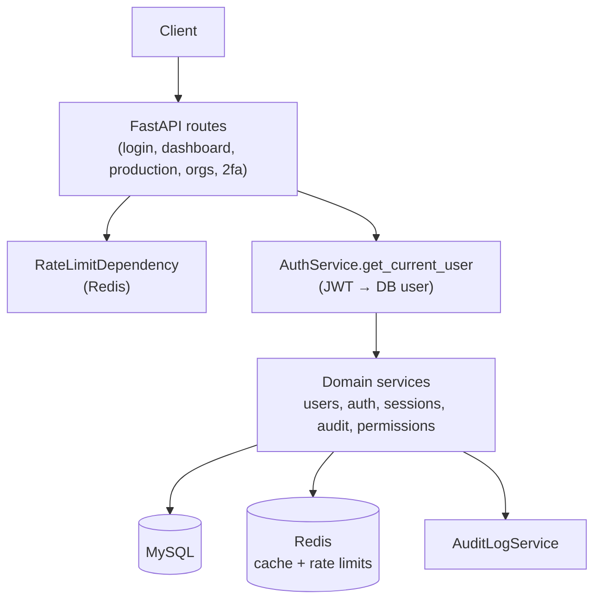

# Backend Architecture & Senior Tester Review

**Project:** FastAPI User Management  
**Branch reviewed:** `feature/codespaces-local-db` (post P0–P5 UI integration)  
**Date:** July 2026  
**Perspective:** Solution architect + senior QA / security tester

---

## Executive verdict

| Area | Rating | Summary |
|------|--------|---------|
| **Architecture / layering** | Good for dev/MVP | Clear route → service → model flow, sensible module split |
| **DB schema** | Mixed | Rich compliance model, but weak integrity + some duplication |
| **Security** | Improving | bcrypt passwords + signup gate; JWT claim risk and half-built authz remain |
| **Multi-tenant / RBAC** | Improving | `role_scope.py` is the right pattern; not applied everywhere |
| **Testability** | Moderate | Lots of integration scripts; thin unit coverage on new rules |

**Bottom line:** Suitable for **Codespaces / demo / learning**. Needs hardening before calling it **enterprise production**.

---

## Request flow (how it works today)



### Typical login path

1. `POST /api/v1/login` → `LoginAttemptService` + lockout check
2. `AuthService.authenticate_user` → `UserService` + password verify
3. `RefreshTokenService` creates refresh row in `refresh_tokens`
4. `EnhancedLoginService` / session logic may also touch `user_sessions`
5. JWT issued with `role`, `organization_id` in claims
6. Audit + logging via `auth_logger` / `AuditLogService`

### Typical admin user read

1. Bearer token → `AuthService.get_current_user` (reloads user from DB)
2. `UserService.get_users_by_role_and_organization`
3. `role_scope.filter_users_for_viewer` enforces org + role visibility

Using the **database role** (not stale JWT claims) for user listings was the correct fix for org-admin / admin scoping bugs.

---

## DB schema — what is solid

### Core identity

```
organizations ──< users ──< refresh_tokens
                    │
                    └── manager_id → users (self-FK, P3)
```

- `organizations` + `users.organization_id` = correct multi-tenant anchor
- `manager_id` self-reference = reasonable reporting hierarchy
- `refresh_tokens` with FK to `users` = proper session token storage
- Indexes on hot columns (`username`, `email`, `role`, `manager_id`) are sensible

### Compliance / M8 tables

| Table | Purpose |
|-------|---------|
| `user_sessions` | Device/browser session analytics |
| `audit_logs` | Compliance trail |
| `password_history` | Password reuse policy |
| `login_attempts` | Security monitoring |
| `user_permissions` | Fine-grained authz |
| `user_groups` + `user_group_memberships` | Group RBAC |
| `api_keys` | Programmatic access |

The **domain model is complete on paper**. The gap: many of these are **read-only APIs** — no create/update/delete routes for groups, permissions, or API keys.

---

## DB schema — architectural concerns

### 1. Two session systems (high risk)

The system maintains **both**:

- `refresh_tokens` (auth/session control)
- `user_sessions` (analytics/compliance)

They can drift apart. Logout, revoke, and cleanup must keep both in sync.

**Recommendation:** Pick one source of truth, or define an explicit sync contract in one service.

### 2. Missing foreign keys on production tables

`user_model.py` notes: *"New Production Tables (without foreign keys, using indexes)"*.

`user_sessions`, `audit_logs`, `user_permissions`, etc. store `user_id` / `organization_id` as integers only.

| Impact | |
|--------|--|
| Orphan rows when users are deleted | Likely |
| Referential integrity | App-enforced only |
| Join correctness | Depends on discipline |

Acceptable for a prototype; **not acceptable** for regulated production without FKs or soft-delete everywhere.

### 3. Weak typing in DB

- `users.role`, `users.status` = free `String(20)` — no DB enum/check constraint
- Typos (`organisation_admin`, `SUPER_ADMIN`) have caused real bugs

**Recommendation:** DB check constraint or enum + single `Role` enum enforced in code and DB.

### 4. Duplicate login-attempt tracking

On `users`:

- `login_attempts`
- `failed_login_attempts`
- `locked_until`

Plus table `login_attempts`.

Three mechanisms for one concern — confusing for testers and maintainers.

### 5. Schema evolution is fragile

- `bootstrap_local_db.py` → `create_all`
- Ad-hoc scripts (`migrate_2fa.py`, `migrate_manager_id.py`)

No Alembic. Existing databases will not auto-pick new columns unless recover/migrate runs.

### 6. Org stats vs org table mismatch

Super-admin dashboard org stats historically derived org list from **distinct `users.organization_id`**, not the `organizations` table. P5 CRUD helps, but stats endpoints may still disagree if an org exists with zero users.

---

## Backend code flow — strengths

| Pattern | Where | Why it works |
|---------|--------|--------------|
| Service layer | `services/users`, `services/auth`, etc. | Routes stay thinner (except `login.py`) |
| Central RBAC | `services/users/role_scope.py` | Single place for view/edit rules |
| DB as source of truth for role | `GET /users`, `PATCH /users` | Fixes stale JWT role bugs |
| Correlation IDs | login/signup/admin flows | Traceable audit trail |
| Rate limiting | `RateLimitDependency` | Redis-backed, per-endpoint |
| Structured logging | `auth_logger`, `security_logger` | Ops-friendly |
| Cache invalidation | `cache_service.invalidate_user_profile` on PATCH | Avoids stale profile cache |

---

## Backend code flow — issues (tester view)

### P0 — Security

#### 1. Password hashing — **fixed (P0)**

`utils/jwt_config.py` now uses **bcrypt** for new hashes. Legacy SHA-256 hex (seed data) still verifies; successful login rehashes to bcrypt. Codespaces seed upgraded via `scripts/ensure_bcrypt_seed_passwords.py`.

#### 2. Open signup — **mitigated (P0)**

`SECURITY__ALLOW_PUBLIC_SIGNUP` defaults to **false**; `POST /api/v1/signup` returns 403 when disabled. Codespaces sets it to `true` in `.env.codespaces.example`. Invite-only org assignment remains a follow-up.

#### 3. JWT still embeds role/org

Authorization for listings uses DB (good), but anything reading JWT claims directly is a regression risk after role changes.

---

### P1 — Correctness / RBAC gaps

#### 4. Admin activity stats not scoped like user list — **fixed (P1)**

`GET /admin/activity/stats` now filters audit logs to user IDs returned by `filter_users_for_viewer` (same rules as the admin user list).

#### 5. M8 is read-heavy, write-missing

Compliance APIs expose GET for audit, permissions, groups, API keys — but **no POST/PATCH/DELETE** to create groups, grant permissions, or issue API keys. UI shows empty tables because the backend cannot populate them via API.

#### 6. `login.py` is a god module (~1,500 lines)

Auth, users, password reset, profile, sessions, admin CRUD in one router. Hard to test, review, and secure consistently.

#### 7. Role string bugs were systemic

`SUPER_ADMIN` vs `super_admin` in `production_endpoints.py` — fixed in P4, but shows lack of enum enforcement. Similar bugs can reappear.

---

### P2 — Test / ops gaps

| Gap | Risk |
|-----|------|
| Only `tests/unit/test_role_scope.py` as focused unit test for new RBAC | Regressions in PATCH / manager_id |
| Integration tests are scripts, not CI-gated pytest suite | "Works on my Codespace" |
| No migration versioning | Schema drift between devs |
| Password history / 2FA / session cleanup | Little automated negative testing |

---

## Senior tester — sign-off checklist

### RBAC matrix

| Actor | List users | View user | Edit user | Create user | Compliance | Orgs |
|-------|------------|-----------|-----------|-------------|------------|------|
| `user` | self only | self | profile only | ✗ | limited | ✗ |
| `admin` | users only | users | users | user role | org-scoped | ✗ |
| `organization_admin` | admin+user | same | same | admin+user | org-scoped | ✗ |
| `super_admin` | all | all | all | all roles | all | CRUD |

**Must verify:** `manager_id` rules (admin → self only; org_admin → any admin in org).

### Security tests

- Brute force / lockout after N failures
- Refresh token rotation + revoke others + logout-all
- Role change in DB → old JWT must not expand access
- Cross-org IDOR: user A cannot `GET /users/{id}` for user B in another org
- Signup cannot elevate to admin

### Data integrity tests

- Delete/deactivate user → impact on `manager_id`, sessions, audit rows
- Create org → assign users → stats match `organizations` table
- Session cleanup reduces `user_sessions` and `refresh_tokens` consistently

### Regression suite (highest ROI)

1. Extend `tests/unit/test_role_scope.py` for `can_edit_user`, manager validation
2. API tests for `PATCH /users/{id}` permission matrix
3. One test per role for `GET /users` count
4. `production_endpoints` org filter uses lowercase roles

---

## Intended vs actual architecture

**Intended (good):**

```
Role (JWT) → Auth → DB User → role_scope → Service → Response
```

**Where it still leaks:**

| Area | Issue |
|------|--------|
| Dashboard stats | Sometimes org-wide, not `role_scope` |
| JWT claims | Still issued with role (stale until re-login) |
| M8 permissions | DB tables exist; write path missing |
| Sessions | Two tables; unclear owner |

---

## API integration status (UI)

~**54 of 56** user-facing APIs integrated in the React UI (post P0–P5).

**Not in UI (by design):**

- `POST /debug-login`, `POST /debug-refresh`
- `GET /health`, `/api/v1/health`, `/health/detailed`

---

## Verdict by environment

### Codespaces demo + full UI integration

**Acceptable.** Layering is understandable, RBAC direction is right, schema is rich enough for a user-management showcase.

### Production / compliance-grade

**Not yet.** Remaining blockers:

1. ~~Replace SHA-256 with proper password hashing~~ **done**
2. ~~Lock down or remove public signup~~ **gated by `SECURITY__ALLOW_PUBLIC_SIGNUP`**
3. Apply `role_scope` consistently to all dashboards and compliance queries (admin activity **done**; compliance TBD)
4. Add FKs or soft-delete strategy for compliance tables
5. Introduce Alembic (or equivalent) for schema changes
6. Split `login.py`; add write APIs for M8 entities or descope dead tables
7. Consolidate session model

---

## Recommended priority order

| Priority | Item | Effort |
|----------|------|--------|
| **P0** | bcrypt/argon2 passwords | Small |
| **P0** | Signup policy (disable or invite-only) | Small |
| **P1** | Scope admin activity stats via `role_scope` | Small |
| **P1** | Alembic migrations | Medium |
| **P1** | M8 write APIs (groups, permissions, API keys) or descope | Medium |
| **P2** | Unify session tracking | Medium |
| **P2** | Add FKs to compliance tables | Medium |
| **P2** | Break up `login.py` router | Medium |

---

## Related docs

- [API_REFERENCE.md](./API_REFERENCE.md)
- [PRODUCTION_READINESS_ASSESSMENT_FINAL.md](./PRODUCTION_READINESS_ASSESSMENT_FINAL.md)
- [BACKEND_P0_UI_BLOCKERS.md](./BACKEND_P0_UI_BLOCKERS.md)
- [ADR-001-frontend-auth.md](./ADR-001-frontend-auth.md)

---

## Changelog

| Date | Notes |
|------|-------|
| July 2026 | Initial review after P0–P5 (auth, compliance portal, edit user, org CRUD) |
| July 2026 | **P0/P1 fixes:** bcrypt passwords with legacy SHA-256 migration on login; `SECURITY__ALLOW_PUBLIC_SIGNUP` (default false); admin activity stats scoped via `role_scope` |
| July 2026 | **Architect review P0:** compliance APIs scoped via `compliance_access` + `role_scope`; group members IDOR fix; `SECURITY__ALLOW_DEBUG_AUTH`; admin dashboard logins scoped |
| July 2026 | **Router split:** `login.py` → `auth`, `sessions`, `users`, `profile` (+ optional `debug`) |
| July 2026 | **Alembic baseline:** `alembic upgrade head` in bootstrap; stamp for legacy DBs |
| July 2026 | **Session link (step 3):** `user_sessions.refresh_token_id` set on login; revoke/logout syncs both tables |
