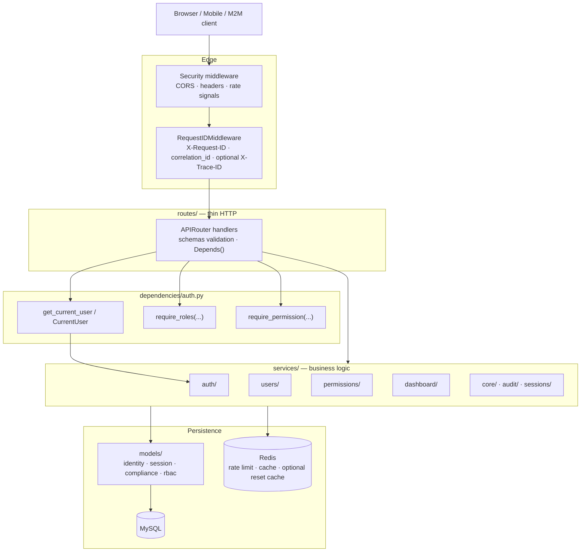
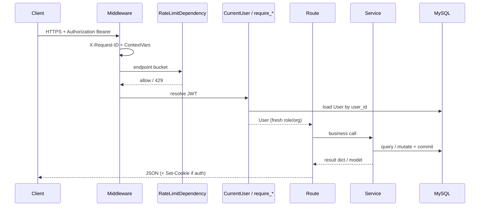
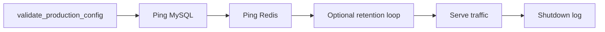
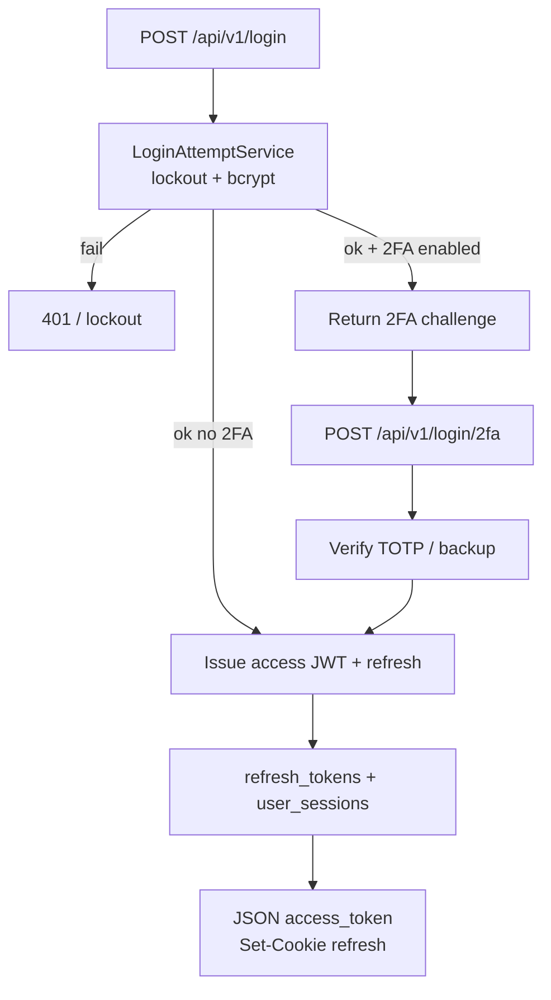
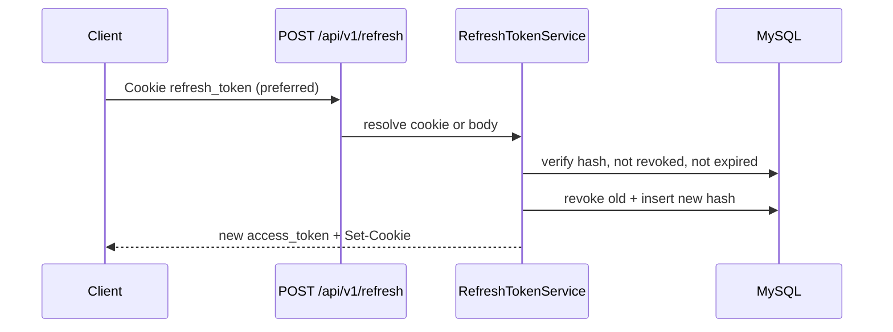
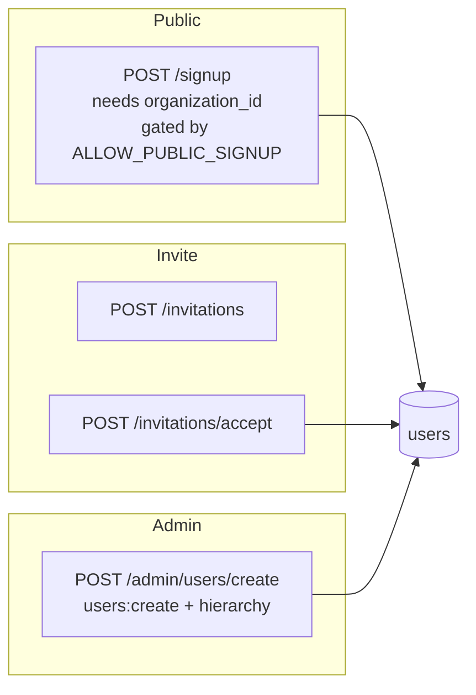
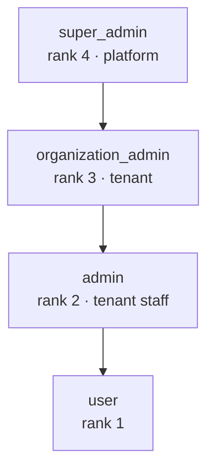
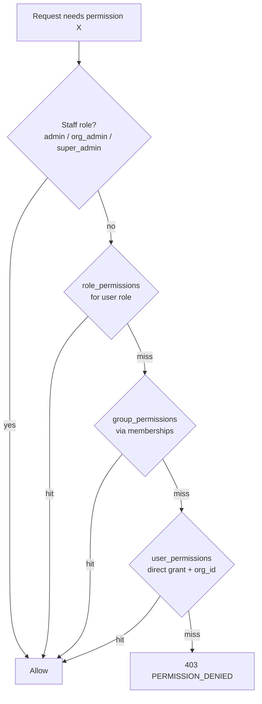
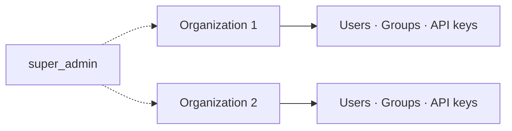
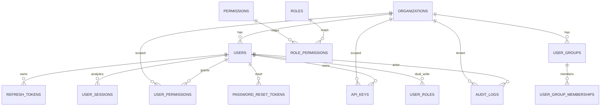

# Backend Code Flow, Hierarchy & API Catalog

Updated **2026-07-14**. Companion to [BACKEND.md](./BACKEND.md) (config/scripts) with **diagrams**, **role hierarchy**, and a full **`/api/v1` endpoint list** reflecting the current codebase.

**Stack:** FastAPI · SQLAlchemy · MySQL · Redis · JWT access · DB refresh tokens (httpOnly cookie) · optional OpenTelemetry  

**Default port:** `9000` · **API prefix:** `/api/v1`

---

## Table of contents

1. [Layer architecture](#1-layer-architecture)
2. [Request code flow](#2-request-code-flow)
3. [Authentication & session flows](#3-authentication--session-flows)
4. [Role hierarchy & RBAC](#4-role-hierarchy--rbac)
5. [Multi-tenancy & data scoping](#5-multi-tenancy--data-scoping)
6. [Domain model map](#6-domain-model-map)
7. [Complete API catalog](#7-complete-api-catalog)
8. [Health & observability](#8-health--observability)

---

## 1. Layer architecture

| Layer | Responsibility | Owns `commit`? |
|-------|----------------|----------------|
| `routes/` | Parse/validate, auth deps, map HTTP ↔ service | No |
| `dependencies/` | JWT / API-key → `User`, role & permission gates | No |
| `services/` | Use-case logic, org scoping, side effects (email, audit) | **Yes** |
| `models/` | ORM tables | — |
| `utils/` | JWT, cookies, Redis, middleware, logging, metrics | — |

See also [TRANSACTION_BOUNDARIES.md](./TRANSACTION_BOUNDARIES.md).

### Package map (models)

| Module | Models |
|--------|--------|
| `models/identity.py` | `Organization`, `User`, `RefreshToken` |
| `models/session.py` | `UserSession`, password/email tokens, invitations, `LoginAttempt` |
| `models/compliance.py` | `AuditLog`, `UserPermission`, groups, `ApiKey`, consents, incidents, retention |
| `models/rbac_model.py` | Catalog `Permission`, `Role`, junctions |
| `models/user_model.py` | Re-exports (compat) |

---

## 2. Request code flow

### 2.1 Authenticated API request (typical)

Steps in order:

1. CORS / security headers / Request ID (+ OTEL span when `OTEL__ENABLED`).
2. Optional `RateLimitDependency` (Redis; production fail-closed).
3. `HTTPBearer` → `AuthService.get_current_user` → DB user row.
4. Optional `require_roles` or `require_permission` (staff bypass → role_permissions → group_permissions → user_permissions).
5. Route → service → ORM; sensitive actions may write `audit_logs`.
6. Response; structured errors via `APIHTTPException` / `error_payload` (`error_code`, `correlation_id`, …).

### 2.2 Startup (`lifespan` in `main.py`)

---

## 3. Authentication & session flows

### Token model

| Token | Where | TTL (default) | Purpose |
|-------|--------|---------------|---------|
| Access JWT | `Authorization: Bearer` | ~5 min | Authorize API calls |
| Refresh (opaque) | httpOnly cookie + `refresh_tokens.token_hash` | ~7 days | Rotate access; revoke sessions |
| API key | `X-API-Key` | Per key | M2M (`/integration/*`) |

Access JWT has **no** server-side revocation list in v1 (short TTL). Refresh revocation is immediate. See [ACCESS_TOKEN_REVOCATION.md](./ACCESS_TOKEN_REVOCATION.md).

### 3.1 Login (password → tokens, optional 2FA challenge)

Related: `POST /login-with-session-control` (session strategies via `EnhancedLoginService`).

### 3.2 Refresh rotation

Reuse of a revoked refresh can trigger security incident handling (reuse detection).

### 3.3 Logout

| Endpoint | Effect |
|----------|--------|
| `POST /logout` | Revoke current refresh (cookie/body); clear cookie |
| `POST /logout-all` | Revoke all refresh tokens for user |
| `POST /sessions/revoke-others` | Keep **current** session; revoke other refreshes |

### 3.4 Public signup vs invite vs admin create

Welcome / verification emails respect `EMAIL__ENABLE_EMAILS` and admin `send_welcome_email`.

---

## 4. Role hierarchy & RBAC

### 4.1 Rank (higher can manage lower)

Source: `services/users/role_scope.py` (`_ROLE_RANK`), `services/users/role_policy.py` (`ROLE_HIERARCHY`).

### 4.2 Who may **create / assign** which roles

| Creator | May assign |
|---------|------------|
| `super_admin` | `organization_admin`, `admin`, `user` |
| `organization_admin` | `admin`, `user` |
| `admin` | `user` |
| `user` | — |

`super_admin` accounts are not created via invite accept; they are platform-scoped (often org “System”).

### 4.3 Who may **view / edit** whom (same org, except super_admin)

| Viewer | Sees roles | Edit rule |
|--------|------------|-----------|
| `super_admin` | All orgs / roles | Any below platform policy |
| `organization_admin` | `organization_admin`, `admin`, `user` in org | Targets with lower rank |
| `admin` | `user` in org | Users only |
| `user` | Self (profile) | Self only |

Org staff **cannot** see `super_admin` rows in tenant lists (`ORG_INVISIBLE_ROLES`).

### 4.4 Permission resolution (`require_permission`)

Catalog lives in DB (`permissions` / `roles` / junctions) with Python fallbacks; API keys validate against catalog on write.

### 4.5 Manager reporting line

`users.manager_id` → same-org manager; cycle detection in `UserService.validate_manager_assignment`. Regular users report to admins within the org.

---

## 5. Multi-tenancy & data scoping

| Concept | Rule |
|---------|------|
| `users.organization_id` | **NOT NULL** — every user belongs to a tenant |
| Staff queries | Forced to viewer’s `organization_id` (except `super_admin`) |
| Compliance lists | `compliance_access.resolve_organization_filter` / `scope_user_ids_for_query` |
| `user_permissions.organization_id` | Denormalized from user at grant time (tenant audits) |
| IDOR | Cross-org resource IDs → 403/404 (smoke: `tests/smoke/test_idor_smoke.py`) |

---

## 6. Domain model map

---

## 7. Complete API catalog

All paths below are under **`/api/v1`** unless noted.  

**Auth legend:** `Public` · `JWT` · `Refresh` · `JWT|API-Key` · `Permission:name` (implies JWT + gate) · `Role:…`

### 7.1 Auth — `routes/auth.py`

| Method | Path | Auth | Notes |
|--------|------|------|-------|
| POST | `/login` | Public | Password; may return 2FA challenge |
| POST | `/login/2fa` | Public | Completes 2FA login |
| POST | `/login-with-session-control` | Public | Session strategy options |
| POST | `/signup` | Public* | `*SECURITY__ALLOW_PUBLIC_SIGNUP`; requires `organization_id` |
| POST | `/refresh` | Refresh | Cookie preferred |
| POST | `/logout` | Refresh/JWT | Revoke current refresh |
| POST | `/logout-all` | JWT | Revoke all refreshes |

### 7.2 Sessions (user) — `routes/sessions.py`

| Method | Path | Auth |
|--------|------|------|
| GET | `/sessions/info` | JWT |
| GET | `/sessions` | JWT |
| DELETE | `/sessions/{session_id}` | JWT |
| POST | `/sessions/revoke-others` | JWT |

### 7.3 Profile & recovery — `routes/profile.py`

| Method | Path | Auth |
|--------|------|------|
| GET | `/profile` | JWT |
| PUT | `/profile` | JWT |
| POST | `/password/change` | JWT |
| POST | `/password/reset-request` | Public |
| POST | `/password/reset` | Public |
| GET | `/password/reset/validate/{token}` | Public |
| POST | `/email/verify` | Public |
| POST | `/email/resend-verification` | Public / gated |

### 7.4 2FA — `routes/auth_2fa.py`

| Method | Path | Auth |
|--------|------|------|
| POST | `/2fa/enable` | JWT |
| POST | `/2fa/verify` | JWT |
| POST | `/2fa/disable` | JWT |
| GET | `/2fa/status` | JWT |

### 7.5 Users (admin) — `routes/users.py`

| Method | Path | Auth |
|--------|------|------|
| GET | `/users` | JWT + list scope |
| GET | `/users/{user_id}` | JWT + scope |
| PATCH | `/users/{user_id}` | `Permission:users:update` |
| POST | `/admin/users/create` | `Permission:users:create` |
| DELETE | `/users/{user_id}` | `Permission:users:delete` (soft delete) |

### 7.6 Invitations — `routes/invitations.py`

| Method | Path | Auth |
|--------|------|------|
| POST | `/invitations` | `Permission:users:create` |
| GET | `/invitations` | `Permission:users:list` |
| GET | `/invitations/validate/{token}` | Public |
| POST | `/invitations/accept` | Public |
| DELETE | `/invitations/{invitation_id}` | `Permission:users:create` |

### 7.7 Organizations — `routes/organizations.py`

| Method | Path | Auth |
|--------|------|------|
| GET | `/organizations` | JWT (scoped) |
| GET | `/organizations/me/settings` | JWT |
| GET | `/organizations/{organization_id}` | JWT |
| POST | `/organizations` | Super admin |
| PATCH | `/organizations/{organization_id}` | Super admin |
| DELETE | `/organizations/{organization_id}` | Super admin (soft) |
| GET | `/organizations/{id}/settings` | `Permission:organizations:read` |
| PUT | `/organizations/{id}/settings/{key}` | `Permission:organizations:update` |
| DELETE | `/organizations/{id}/settings/{key}` | `Permission:organizations:update` |

### 7.8 Dashboard — `routes/dashboard.py` (`/api/v1/dashboard/...`)

| Method | Path | Auth |
|--------|------|------|
| GET | `/user/overview` | JWT |
| GET | `/user/activity` | JWT |
| GET | `/user/sessions` | JWT |
| GET | `/admin/overview` | Role:admin |
| GET | `/admin/users/stats` | Role:admin |
| GET | `/admin/activity/stats` | Role:admin |
| GET | `/organization-admin/overview` | Role:organization_admin |
| GET | `/organization-admin/users/stats` | Role:organization_admin |
| GET | `/organization-admin/sessions/stats` | Role:organization_admin |
| GET | `/super-admin/overview` | Role:super_admin |
| GET | `/super-admin/users/stats` | Role:super_admin |
| GET | `/super-admin/organizations/stats` | Role:super_admin |
| GET | `/super-admin/sessions/stats` | Role:super_admin |

### 7.9 Permissions — `routes/permissions_mgmt.py`

| Method | Path | Auth |
|--------|------|------|
| GET | `/permissions` | JWT (self or scoped) |
| GET | `/permissions/standard` | JWT |
| GET | `/permissions/statistics` | `Permission:permissions:read` |

### 7.10 Groups — `routes/groups.py`

| Method | Path | Auth |
|--------|------|------|
| GET | `/groups` | `Permission:groups:read` |
| POST | `/groups` | `Permission:groups:create` |
| PATCH | `/groups/{group_id}` | `Permission:groups:update` |
| DELETE | `/groups/{group_id}` | `Permission:groups:delete` |
| GET | `/groups/{group_id}/members` | `Permission:groups:read` |
| POST | `/groups/{group_id}/members` | `Permission:groups:update` |
| DELETE | `/groups/{group_id}/members/{user_id}` | `Permission:groups:update` |
| GET | `/groups/statistics` | `Permission:groups:read` |
| GET | `/groups/{group_id}/permissions` | `Permission:groups:read` |
| POST | `/groups/{group_id}/permissions` | `Permission:permissions:grant` |
| DELETE | `/groups/{group_id}/permissions/{permission_name}` | `Permission:permissions:revoke` |

### 7.11 API keys — `routes/api_keys.py`

| Method | Path | Auth |
|--------|------|------|
| GET | `/api-keys` | JWT (scoped) |
| POST | `/api-keys` | `Permission:api_keys:create` |
| PATCH | `/api-keys/{api_key_id}` | JWT + access check |
| DELETE | `/api-keys/{api_key_id}` | JWT + access check |
| GET | `/api-keys/standard-permissions` | JWT |
| GET | `/api-keys/statistics` | `Permission:api_keys:read` |

### 7.12 Audit — `routes/audit.py`

| Method | Path | Auth |
|--------|------|------|
| GET | `/audit/logs` | `Permission:audit:read` |
| GET | `/audit/statistics` | `Permission:audit:statistics` |

### 7.13 Sessions admin / maintenance — `routes/sessions_admin.py`

| Method | Path | Auth |
|--------|------|------|
| GET | `/sessions/statistics` | `Permission:sessions:read` |
| POST | `/sessions/cleanup` | `Permission:sessions:revoke` |
| POST | `/maintenance/cleanup` | Staff permission (full retention suite) |

### 7.14 Password history — `routes/password_history.py`

| Method | Path | Auth |
|--------|------|------|
| GET | `/password/history` | JWT (scoped) |
| GET | `/password/policy-stats` | Staff |

### 7.15 Retention — `routes/retention.py`

| Method | Path | Auth |
|--------|------|------|
| GET | `/retention/policies` | Permission-gated |
| PUT | `/retention/policies/{table_name}` | Permission-gated |

### 7.16 Compliance — `routes/compliance.py`

| Method | Path | Auth |
|--------|------|------|
| GET | `/consents` | JWT |
| POST | `/consents` | JWT |
| GET | `/security/incidents` | `Permission:security:incidents` |

### 7.17 Integration (M2M) — `routes/integration.py`

| Method | Path | Auth |
|--------|------|------|
| GET | `/integration/whoami` | `JWT\|API-Key` |

### 7.18 Debug (dev only) — `routes/debug.py`

Mounted only when `APP__ENVIRONMENT=development` **and** `SECURITY__ALLOW_DEBUG_AUTH=true`.

| Method | Path | Auth |
|--------|------|------|
| POST | `/debug-login` | Dev |
| POST | `/debug-refresh` | Dev |

---

## 8. Health & observability

| Method | Path | Purpose |
|--------|------|---------|
| GET | `/health` | Liveness-style basic |
| GET | `/api/v1/health` | Versioned basic |
| GET | `/health/live` | K8s liveness |
| GET | `/health/ready` | Ready = **DB** |
| GET | `/health/ready-full` | Ready = DB **+ Redis** |
| GET | `/health/detailed` | Service breakdown (errors redacted in production) |
| GET | `/metrics` | Prometheus-style counters / latency |

Logs: JSON to stdout in production (`correlation_id`, optional `trace_id`). Optional OTEL: `OTEL__ENABLED` + `requirements-otel.txt`.

---

## Related docs

| Doc | Use when |
|-----|----------|
| [BACKEND.md](./BACKEND.md) | Config env vars, scripts, deeper narrative |
| [BACKEND_PRODUCTION_READINESS.md](./BACKEND_PRODUCTION_READINESS.md) | Go-live checklist status |
| [DATABASE_SCHEMA_REVIEW.md](./DATABASE_SCHEMA_REVIEW.md) | Tables, migrations, indexes |
| [API_VERSIONING.md](./API_VERSIONING.md) | `/api/v1` vs `/api/v2` policy |
| [DEPLOYMENT_TOPOLOGY.md](./DEPLOYMENT_TOPOLOGY.md) | Workers vs replicas |
| [TRANSACTION_BOUNDARIES.md](./TRANSACTION_BOUNDARIES.md) | Commit ownership |

*Generate OpenAPI offline:* `python scripts/export_openapi.py artifacts/openapi.json` (also a CI artifact).
