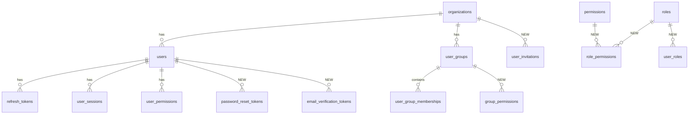

# Database Schema Architecture Review

Complete database architect review of the `fastapi_users` schema (MySQL 8.0). Covers current state, production risks, required schema changes, new tables, index strategy, and migration order.

**Related docs:** [BACKEND.md](./BACKEND.md) · [BACKEND_PRODUCTION_READINESS.md](./BACKEND_PRODUCTION_READINESS.md) · [schema/fastapi_users_schema_latest.sql](./schema/fastapi_users_schema_latest.sql) (live DDL; regenerate with `python scripts/export_schema_sql.py`)

**Legend**

| Priority | Meaning |
|----------|---------|
| **P0** | Block production launch — data integrity, security, tenant isolation |
| **P1** | Required for enterprise production — RBAC, lifecycle, operations |
| **P2** | Strongly recommended — performance, index hygiene, scale readiness |

| Status | Meaning |
|--------|---------|
| ⬜ | Not started |
| 🔄 | In progress |
| ✅ | Done |

---

## Table of contents

1. [Executive summary](#1-executive-summary)
2. [Current schema inventory](#2-current-schema-inventory)
3. [P0 — Fix before production](#3-p0--fix-before-production)
4. [P1 — Enterprise-grade requirements](#4-p1--enterprise-grade-requirements)
5. [P2 — Index optimization](#5-p2--index-optimization)
6. [Recommended new tables](#6-recommended-new-tables)
7. [Entity relationship — current vs target](#7-entity-relationship--current-vs-target)
8. [Production checklist (schema-specific)](#8-production-checklist-schema-specific)
9. [Recommended migration order](#9-recommended-migration-order)
10. [Summary counts](#10-summary-counts)

---

## 1. Executive summary

**Database:** `fastapi_users` (MySQL 8.0, Podman/Docker)  
**Scope:** 12 tables — identity, auth, sessions, RBAC, compliance  
**Verdict:** Solid foundation for dev/staging IAM, but **not production-ready** without schema hardening, missing operational tables, and RBAC normalization.

The schema covers core IAM well: users, organizations, sessions, audit, API keys, groups, and permissions. Main production risks fall into five buckets:

1. **Weak data integrity** — free-text enums, nullable tenant keys, no cross-table org checks
2. **Incomplete auth lifecycle** — reset/verify/invite flows live outside the database (Redis only)
3. **RBAC is half-modeled** — roles and group permissions are not first-class relational data
4. **Operational tables missing** — retention, revocation, invitations, compliance
5. **Index/migration drift** — over-indexed audit table, missing composite indexes, Alembic uses `create_all()`

---

## 2. Current schema inventory

| # | Table | Purpose | Approx. size (local) |
|---|-------|---------|----------------------|
| 1 | `organizations` | Tenant/organization records | 48K |
| 2 | `users` | User accounts, auth, 2FA, roles | 112K |
| 3 | `refresh_tokens` | Opaque JWT refresh token storage | 64K |
| 4 | `user_sessions` | Active session tracking + device metadata | 176K |
| 5 | `audit_logs` | Compliance and security audit trail | 224K |
| 6 | `login_attempts` | Login success/failure tracking | 112K |
| 7 | `password_history` | Previous password hashes | 96K |
| 8 | `user_permissions` | Granular permissions beyond roles | 160K |
| 9 | `user_groups` | Groups within an organization | 112K |
| 10 | `user_group_memberships` | Many-to-many users ↔ groups | 144K |
| 11 | `api_keys` | Programmatic API access keys | 192K |
| 12 | `alembic_version` | Alembic migration tracking (internal) | 16K |

### 2.1 Current table schemas

#### `organizations`

| Column | Type | Constraints |
|--------|------|-------------|
| `id` | INT | PK, AUTO_INCREMENT |
| `name` | VARCHAR(100) | NOT NULL, UNIQUE |
| `description` | TEXT | |
| `status` | VARCHAR(20) | No CHECK/ENUM |
| `created_at` | DATETIME | DEFAULT now() |
| `updated_at` | DATETIME | |

#### `users`

| Column | Type | Constraints |
|--------|------|-------------|
| `id` | INT | PK, AUTO_INCREMENT |
| `username` | VARCHAR(50) | NOT NULL, UNIQUE |
| `password` | VARCHAR(255) | NOT NULL (stores hash, misleading name) |
| `email` | VARCHAR(100) | NOT NULL, UNIQUE |
| `status` | VARCHAR(20) | No CHECK/ENUM |
| `phone_number` | VARCHAR(20) | |
| `created_at` | DATETIME | DEFAULT now() |
| `updated_at` | DATETIME | |
| `last_login` | DATETIME | |
| `login_attempts` | INT | **Dead column** — unused |
| `locked_until` | DATETIME | |
| `is_2fa_enabled` | TINYINT(1) | INDEX |
| `two_factor_secret` | VARCHAR(255) | Stored in plaintext |
| `backup_codes` | JSON | |
| `failed_login_attempts` | INT | Active lockout counter |
| `role` | VARCHAR(20) | Free-form string, no ENUM |
| `organization_id` | INT | FK → `organizations.id` (RESTRICT), nullable, default 1 |
| `manager_id` | INT | FK → `users.id` (SET NULL), self-referencing |

#### `refresh_tokens`

| Column | Type | Constraints |
|--------|------|-------------|
| `id` | INT | PK, AUTO_INCREMENT |
| `user_id` | INT | NOT NULL, FK → `users.id` (CASCADE) |
| `token_hash` | VARCHAR(255) | NOT NULL, UNIQUE |
| `expires_at` | DATETIME | NOT NULL |
| `created_at` | DATETIME | DEFAULT now() |
| `device_info` | TEXT | |
| `ip_address` | VARCHAR(45) | |
| `user_agent` | TEXT | |
| `is_revoked` | TINYINT(1) | |
| `revoked_at` | DATETIME | |

#### `user_sessions`

| Column | Type | Constraints |
|--------|------|-------------|
| `id` | INT | PK, AUTO_INCREMENT |
| `user_id` | INT | NOT NULL, FK → `users.id` (CASCADE) |
| `session_id` | VARCHAR(255) | NOT NULL, UNIQUE |
| `access_token_hash` | VARCHAR(255) | |
| `refresh_token_id` | INT | FK → `refresh_tokens.id` (SET NULL) |
| `device_fingerprint` | VARCHAR(255) | INDEX |
| `device_name` | VARCHAR(100) | |
| `device_type` | VARCHAR(50) | |
| `browser_name` | VARCHAR(50) | |
| `browser_version` | VARCHAR(20) | |
| `os_name` | VARCHAR(50) | |
| `os_version` | VARCHAR(20) | |
| `ip_address` | VARCHAR(45) | |
| `country` | VARCHAR(50) | |
| `city` | VARCHAR(100) | |
| `is_active` | TINYINT(1) | |
| `last_activity` | DATETIME | DEFAULT now() |
| `created_at` | DATETIME | DEFAULT now() |
| `expires_at` | DATETIME | NOT NULL |

#### `audit_logs`

| Column | Type | Constraints |
|--------|------|-------------|
| `id` | INT | PK, AUTO_INCREMENT |
| `user_id` | INT | FK → `users.id` (SET NULL) |
| `organization_id` | INT | FK → `organizations.id` (SET NULL) |
| `event_type` | VARCHAR(50) | NOT NULL |
| `event_category` | VARCHAR(30) | |
| `resource_type` | VARCHAR(50) | |
| `resource_id` | INT | |
| `action` | VARCHAR(50) | |
| `old_values` | JSON | |
| `new_values` | JSON | |
| `ip_address` | VARCHAR(45) | |
| `user_agent` | TEXT | |
| `request_id` | VARCHAR(100) | |
| `correlation_id` | VARCHAR(100) | |
| `status` | VARCHAR(20) | No CHECK/ENUM |
| `error_message` | TEXT | |
| `log_metadata` | JSON | |
| `created_at` | DATETIME | DEFAULT now() |

#### `login_attempts`

| Column | Type | Constraints |
|--------|------|-------------|
| `id` | INT | PK, AUTO_INCREMENT |
| `user_id` | INT | FK → `users.id` (SET NULL) |
| `username` | VARCHAR(255) | NOT NULL |
| `ip_address` | VARCHAR(45) | NOT NULL |
| `user_agent` | TEXT | |
| `success` | TINYINT(1) | |
| `failure_reason` | VARCHAR(255) | |
| `created_at` | DATETIME | DEFAULT now() |

#### `password_history`

| Column | Type | Constraints |
|--------|------|-------------|
| `id` | INT | PK, AUTO_INCREMENT |
| `user_id` | INT | NOT NULL, FK → `users.id` (CASCADE) |
| `password_hash` | VARCHAR(255) | NOT NULL |
| `created_at` | DATETIME | DEFAULT now() |
| `changed_by` | INT | FK → `users.id` (SET NULL) |
| `change_reason` | VARCHAR(50) | password_reset, password_change, admin_reset |

#### `user_permissions`

| Column | Type | Constraints |
|--------|------|-------------|
| `id` | INT | PK, AUTO_INCREMENT |
| `user_id` | INT | NOT NULL, FK → `users.id` (CASCADE) |
| `permission_name` | VARCHAR(100) | NOT NULL |
| `resource_type` | VARCHAR(50) | |
| `resource_id` | INT | |
| `granted_by` | INT | FK → `users.id` (SET NULL) |
| `granted_at` | DATETIME | DEFAULT now() |
| `expires_at` | DATETIME | |
| `is_active` | TINYINT(1) | No DB unique constraint |

#### `user_groups`

| Column | Type | Constraints |
|--------|------|-------------|
| `id` | INT | PK, AUTO_INCREMENT |
| `organization_id` | INT | NOT NULL, FK → `organizations.id` (CASCADE) |
| `name` | VARCHAR(100) | NOT NULL — **no unique per org** |
| `description` | TEXT | |
| `created_by` | INT | NOT NULL, FK → `users.id` (RESTRICT) |
| `created_at` | DATETIME | DEFAULT now() |
| `updated_at` | DATETIME | |
| `is_active` | TINYINT(1) | Soft delete flag |

#### `user_group_memberships`

| Column | Type | Constraints |
|--------|------|-------------|
| `id` | INT | PK, AUTO_INCREMENT |
| `user_id` | INT | NOT NULL, FK → `users.id` (CASCADE) |
| `group_id` | INT | NOT NULL, FK → `user_groups.id` (CASCADE) |
| `added_by` | INT | NOT NULL, FK → `users.id` (RESTRICT) |
| `added_at` | DATETIME | DEFAULT now() |
| `expires_at` | DATETIME | |
| `is_active` | TINYINT(1) | |
| | | UNIQUE (`user_id`, `group_id`) — **no org cross-check** |

#### `api_keys`

| Column | Type | Constraints |
|--------|------|-------------|
| `id` | INT | PK, AUTO_INCREMENT |
| `user_id` | INT | NOT NULL, FK → `users.id` (CASCADE) |
| `organization_id` | INT | NOT NULL, FK → `organizations.id` (CASCADE) |
| `key_name` | VARCHAR(100) | NOT NULL |
| `key_hash` | VARCHAR(255) | NOT NULL, UNIQUE |
| `key_prefix` | VARCHAR(20) | NOT NULL |
| `permissions` | JSON | No schema validation at DB |
| `rate_limit_per_minute` | INT | |
| `rate_limit_per_hour` | INT | |
| `last_used_at` | DATETIME | |
| `expires_at` | DATETIME | |
| `is_active` | TINYINT(1) | |
| `created_at` | DATETIME | DEFAULT now() |
| `created_by` | INT | NOT NULL, FK → `users.id` (RESTRICT) |

#### `alembic_version`

| Column | Type | Constraints |
|--------|------|-------------|
| `version_num` | VARCHAR(32) | PK |

---

## 3. P0 — Fix before production

### 3.1 No database constraints on critical enums

| # | Status | Issue | Location | Required change |
|---|--------|-------|----------|-----------------|
| 3.1.1 | ✅ | `users.role` is free-form VARCHAR | `models/user_model.py:59` | Add ENUM or CHECK: `user`, `admin`, `organization_admin`, `super_admin` |
| 3.1.2 | ✅ | `users.status` is free-form VARCHAR | `models/user_model.py:44` | Add ENUM: `active`, `inactive`, `suspended`, `pending` |
| 3.1.3 | ✅ | `organizations.status` is free-form VARCHAR | `models/user_model.py:12` | Add ENUM: `active`, `inactive`, `suspended` |
| 3.1.4 | ✅ | `audit_logs.status` is free-form VARCHAR | `models/user_model.py:126` | Add ENUM: `success`, `failure`, `error` |

**Risk:** Typos (`admn`, `activ`) create users that pass DB writes but fail authorization unpredictably.

**Migration example:**

```sql
ALTER TABLE users
  MODIFY role ENUM('user','admin','organization_admin','super_admin') NOT NULL DEFAULT 'user',
  MODIFY status ENUM('active','inactive','suspended','pending') NOT NULL DEFAULT 'pending';

ALTER TABLE organizations
  MODIFY status ENUM('active','inactive','suspended') NOT NULL DEFAULT 'active';

ALTER TABLE audit_logs
  MODIFY status ENUM('success','failure','error') NULL;
```

---

### 3.2 Tenant isolation gaps (multi-tenant bleed)

| # | Status | Issue | Location | Required change |
|---|--------|-------|----------|-----------------|
| 3.2.1 | ✅ | `users.organization_id` nullable with default `1` | `models/user_model.py:60` | `NOT NULL`; remove default `1`; require explicit org on create |
| 3.2.2 | ✅ | `user_group_memberships` has no org check | `user_group_memberships` table | Validate `users.organization_id = user_groups.organization_id` via trigger or app + composite check |
| 3.2.3 | ✅ | `user_permissions` has no `organization_id` | `user_permissions` table | Added + backfilled in `20260714_perm_org_id` |
| 3.2.4 | ✅ | `manager_id` has no same-org constraint | `users.manager_id` | Enforce manager belongs to same organization (trigger or app validation) |
| 3.2.5 | ✅ | Public signup defaults to org 1 | `UserSignupRequest`, `user_service.create_user()` | `organization_id` required; org existence validated |

**Risk:** Cross-tenant data bleed if application layer misses a check.

---

### 3.3 Duplicate foreign key constraints

| # | Status | Issue | Location | Required change |
|---|--------|-------|----------|-----------------|
| 3.3.1 | ✅ | Duplicate FKs on `api_keys` | `api_keys_ibfk_*` + `fk_api_keys_*` | Dropped `*_ibfk_*` in `20260714_drop_dup_fks` |
| 3.3.2 | ✅ | Duplicate FKs on `audit_logs` | `audit_logs_ibfk_*` + `fk_audit_logs_*` | Same |
| 3.3.3 | ✅ | Duplicate FKs on `login_attempts` | `login_attempts_ibfk_*` + `fk_login_attempts_*` | Same |
| 3.3.4 | ✅ | Duplicate FKs on `password_history` | `password_history_ibfk_*` + `fk_password_history_*` | Same |
| 3.3.5 | ✅ | Duplicate FKs on `user_groups` | `user_groups_ibfk_*` + `fk_user_groups_*` | Same |
| 3.3.6 | ✅ | Duplicate FKs on `user_group_memberships` | `user_group_memberships_ibfk_*` + `fk_user_group_memberships_*` | Same |
| 3.3.7 | ✅ | Duplicate FKs on `user_permissions` | `user_permissions_ibfk_*` + `fk_user_permissions_*` | Same |
| 3.3.8 | ✅ | Duplicate FKs on `user_sessions` | `user_sessions_ibfk_*` + `fk_user_sessions_*` | Same |

**Risk:** Slower writes, confusing `information_schema`, harder drops/migrations.

---

### 3.4 Dead / duplicate / missing columns on `users`

| # | Status | Issue | Location | Required change |
|---|--------|-------|----------|-----------------|
| 3.4.1 | ✅ | `login_attempts` column unused | `models/user_model.py:49` | Drop column; `failed_login_attempts` is the real counter |
| 3.4.2 | ✅ | `password` column name misleading | `models/user_model.py` | Renamed to `password_hash` via `20260714_password_hash_col` |
| 3.4.3 | ✅ | No `email_verified_at` | `users` table | Add column; enforce verified-email login |
| 3.4.4 | ✅ | No `password_changed_at` | `users` table | Add column; enforce `max_password_age_days` policy |

---

### 3.5 Sensitive data stored without DB-level protection

| # | Status | Issue | Location | Required change |
|---|--------|-------|----------|-----------------|
| 3.5.1 | ✅ | `two_factor_secret` stored in plaintext | `models/user_model.py:54` | Encrypt at rest (Fernet); never return after initial enable |
| 3.5.2 | ✅ | `backup_codes` JSON without rotation metadata | `users.backup_codes` | `backup_codes_generated_at` added; codes hashed |
| 3.5.3 | ✅ | `api_keys.permissions` JSON without schema validation | `api_keys.permissions` | Validated via `ApiKeyService.validate_permissions` + RBAC catalog |

---

### 3.6 Password reset has no durable DB table

| # | Status | Issue | Location | Required change |
|---|--------|-------|----------|-----------------|
| 3.6.1 | ✅ | Reset tokens stored only in Redis | `services/users/password_reset_service.py` | Create `password_reset_tokens` table; store hashed tokens |
| 3.6.2 | ✅ | No forensic audit trail for resets | Redis-only storage | DB `password_reset_tokens` + `audit_logs` on request/complete |
| 3.6.3 | ✅ | Token lost on Redis flush | `password_reset_service.py` | DB-backed tokens with expiry; Redis as optional cache layer |

**Recommended table:**

```sql
CREATE TABLE password_reset_tokens (
  id            BIGINT PRIMARY KEY AUTO_INCREMENT,
  user_id       INT NOT NULL,
  token_hash    VARCHAR(255) NOT NULL,
  expires_at    DATETIME NOT NULL,
  used_at       DATETIME NULL,
  requested_ip  VARCHAR(45),
  created_at    DATETIME NOT NULL DEFAULT CURRENT_TIMESTAMP,
  CONSTRAINT fk_prt_user_id FOREIGN KEY (user_id) REFERENCES users(id) ON DELETE CASCADE,
  UNIQUE KEY uq_prt_token_hash (token_hash),
  INDEX idx_prt_user_expires (user_id, expires_at)
) ENGINE=InnoDB DEFAULT CHARSET=utf8mb4 COLLATE=utf8mb4_0900_ai_ci;
```

Store **hashed** tokens only, same pattern as `refresh_tokens`.

---

## 4. P1 — Enterprise-grade requirements

### 4.1 RBAC is not normalized

| # | Status | Issue | Location | Required change |
|---|--------|-------|----------|-----------------|
| 4.1.1 | ✅ | `users.role` is a single string | `users.role` | Dual-write + effective-role hydration; column kept for compatibility |
| 4.1.2 | ✅ | Permission catalog in Python only | `UserPermissionService.STANDARD_PERMISSIONS` | Create `permissions` table as canonical catalog |
| 4.1.3 | ✅ | Groups do not grant permissions at DB level | `user_groups` | Create `group_permissions` junction table |
| 4.1.4 | ✅ | No `role_permissions` mapping | — | Create `role_permissions` table |
| 4.1.5 | ✅ | API key permissions in code only | `ApiKeyService.STANDARD_API_PERMISSIONS` | Write-path validates against catalog (`RbacCatalogService`) |

**Current model:**

```
users.role              → single string
user_permissions        → flat grants per user
user_groups             → groups exist
user_group_memberships  → users in groups
(missing)               → groups do NOT grant permissions at DB level
```

**Risk:** Permission catalog changes require deploys; group-based RBAC is incomplete; no audit of "what role X allows."

**Recommended tables:**

| Table | Columns (key) | Purpose |
|-------|---------------|---------|
| `permissions` | `id`, `name`, `description`, `category` | Canonical permission catalog |
| `roles` | `id`, `name`, `organization_id`, `is_system` | Role definitions (NULL org = system role) |
| `role_permissions` | `role_id`, `permission_id` | Permissions per role |
| `user_roles` | `user_id`, `role_id`, `granted_by`, `granted_at` | Many-to-many user ↔ role |
| `group_permissions` | `group_id`, `permission_id` | Permissions granted via group |

---

### 4.2 Missing identity lifecycle tables

| # | Status | Table | Purpose | Required change |
|---|--------|-------|---------|-----------------|
| 4.2.1 | ✅ | `email_verification_tokens` | Signup / email change verification | Create table with hashed token, expiry, used_at |
| 4.2.2 | ✅ | `user_invitations` | Admin invite flow | Create table with org, role, email, token, expiry, accepted_at |
| 4.2.3 | ⏸ | `account_lockouts` | IP/device lockouts | Deferred — lockouts live on `users.locked_until` + `login_attempts` |
| 4.2.4 | ⏸ | `access_token_revocations` | JWT `jti` blocklist | Deferred — [ACCESS_TOKEN_REVOCATION.md](./ACCESS_TOKEN_REVOCATION.md); short access TTL |

**`email_verification_tokens` example:**

```sql
CREATE TABLE email_verification_tokens (
  id            BIGINT PRIMARY KEY AUTO_INCREMENT,
  user_id       INT NOT NULL,
  email         VARCHAR(255) NOT NULL,
  token_hash    VARCHAR(255) NOT NULL,
  expires_at    DATETIME NOT NULL,
  verified_at   DATETIME NULL,
  created_at    DATETIME NOT NULL DEFAULT CURRENT_TIMESTAMP,
  CONSTRAINT fk_evt_user_id FOREIGN KEY (user_id) REFERENCES users(id) ON DELETE CASCADE,
  UNIQUE KEY uq_evt_token_hash (token_hash),
  INDEX idx_evt_user_expires (user_id, expires_at)
) ENGINE=InnoDB DEFAULT CHARSET=utf8mb4 COLLATE=utf8mb4_0900_ai_ci;
```

**`user_invitations` example:**

```sql
CREATE TABLE user_invitations (
  id              BIGINT PRIMARY KEY AUTO_INCREMENT,
  organization_id INT NOT NULL,
  email           VARCHAR(255) NOT NULL,
  role_id         INT NOT NULL,
  token_hash      VARCHAR(255) NOT NULL,
  invited_by      INT NOT NULL,
  expires_at      DATETIME NOT NULL,
  accepted_at     DATETIME NULL,
  created_at      DATETIME NOT NULL DEFAULT CURRENT_TIMESTAMP,
  CONSTRAINT fk_inv_org FOREIGN KEY (organization_id) REFERENCES organizations(id) ON DELETE CASCADE,
  CONSTRAINT fk_inv_invited_by FOREIGN KEY (invited_by) REFERENCES users(id) ON DELETE RESTRICT,
  UNIQUE KEY uq_inv_token_hash (token_hash),
  INDEX idx_inv_org_email (organization_id, email),
  INDEX idx_inv_expires (expires_at)
) ENGINE=InnoDB DEFAULT CHARSET=utf8mb4 COLLATE=utf8mb4_0900_ai_ci;
```

---

### 4.3 Missing uniqueness constraints

| # | Status | Issue | Location | Required change |
|---|--------|-------|----------|-----------------|
| 4.3.1 | ✅ | Duplicate group names per org allowed | `user_groups` | `UNIQUE (organization_id, name)` |
| 4.3.2 | ✅ | Duplicate permissions per user allowed at DB level | `user_permissions` | `UNIQUE (user_id, permission_name, resource_type, resource_id)` |
| 4.3.3 | ✅ | No org slug for URLs/SSO | `organizations` | Add `slug VARCHAR(100) UNIQUE` |

---

### 4.4 Soft delete vs hard CASCADE

| # | Status | Issue | Location | Required change |
|---|--------|-------|----------|-----------------|
| 4.4.1 | ✅ | Groups use soft delete (`is_active`) | `user_groups` | Keep pattern; extend to users/orgs |
| 4.4.2 | ✅ | Users hard-deleted with CASCADE on children | `users` FK children | Add `deleted_at`, `deleted_by`; soft delete instead |
| 4.4.3 | ✅ | Organizations hard-deleted | `organizations` | Add `deleted_at`; soft delete with retention purge job |
| 4.4.4 | ✅ | No archive flow for org with users | `organizations` RESTRICT | Implement soft delete + transfer users before hard purge |

---

### 4.5 Unbounded growth tables (no retention strategy)

| # | Status | Table | Risk | Required change |
|---|--------|-------|------|-----------------|
| 4.5.1 | ✅ | `audit_logs` | Grows forever; 13 single-column indexes | Age purge live (`APP__AUDIT_LOGS_RETENTION_DAYS`); partitioning deferred |
| 4.5.2 | ✅ | `login_attempts` | Grows forever | Age purge live (`APP__LOGIN_ATTEMPTS_RETENTION_DAYS`); partitioning deferred |
| 4.5.3 | ✅ | `password_history` | Retention configured but no purge job | Scheduled purge per `password_history_retention_days` |
| 4.5.4 | ✅ | `refresh_tokens` | Expired rows not auto-purged | `RetentionService` + `/maintenance/cleanup` / optional background job |
| 4.5.5 | ✅ | `user_sessions` | Inactive sessions accumulate | Same retention suite (`UserSessionService.cleanup_expired_sessions`) |

**Partitioning example (audit_logs):**

```sql
ALTER TABLE audit_logs
  PARTITION BY RANGE (TO_DAYS(created_at)) (
    PARTITION p202607 VALUES LESS THAN (TO_DAYS('2026-08-01')),
    PARTITION p202608 VALUES LESS THAN (TO_DAYS('2026-09-01')),
    PARTITION p_future VALUES LESS THAN MAXVALUE
  );
```

---

### 4.6 Datetime without timezone

| # | Status | Issue | Location | Required change |
|---|--------|-------|----------|-----------------|
| 4.6.1 | ✅ | All timestamps are naive `DATETIME` | All tables | Documented UTC convention (`docs/UTC_DATETIME_CONVENTION.md`) |
| 4.6.2 | ✅ | `datetime.utcnow()` used in services | App code | Migrated to `utc_now()` (tests/`scripts` may still use utcnow) |
| 4.6.3 | ⏸ | PostgreSQL migration loses TZ info | Neon path | Deferred — MySQL primary; UTC convention documented |

---

### 4.7 Migration strategy is not production-safe

| # | Status | Issue | Location | Required change |
|---|--------|-------|----------|-----------------|
| 4.7.1 | ✅ | Baseline uses `create_all()` | `alembic/versions/20260708_baseline_schema.py` | Empty DB → metadata create; existing `users` → no-op (stamp path); later revisions idempotent |
| 4.7.2 | ✅ | Index scripts outside Alembic | `scripts/add_database_indexes*.py` | Folded into Alembic; scripts deprecated |
| 4.7.3 | ✅ | Index scripts may drift from live schema | `scripts/` vs `information_schema` | Alembic is single source of truth |
| 4.7.4 | ✅ | No downgrade tests in CI | `tests/integration/test_alembic_downgrade.py` | Latest revision downgrade `-1` + upgrade smoke |

---

### 4.8 Manager hierarchy without cycle prevention

| # | Status | Issue | Location | Required change |
|---|--------|-------|----------|-----------------|
| 4.8.1 | ✅ | `manager_id` self-reference allows cycles | `users.manager_id` | App-level cycle detection on update; optional trigger |
| 4.8.2 | ✅ | Manager can be from different org | `users.manager_id` | Enforce same `organization_id` as managed user |

---

### 4.9 Integer auto-increment IDs (enumerable)

| # | Status | Issue | Location | Required change |
|---|--------|-------|----------|-----------------|
| 4.9.1 | ✅ | Sequential INT PKs on all tables | All tables | Accepted with expanded IDOR smoke matrix; UUID public IDs deferred |
| 4.9.2 | ✅ | `resource_id` in permissions/audit is untyped INT | `user_permissions`, `audit_logs` | Documented pairing via `resource_type` + `resource_id`; app must set both together |

---

## 5. P2 — Index optimization

### 5.1 Over-indexed: `audit_logs`

**Current:** 13 single-column indexes. Every insert updates many index trees.

| # | Status | Action | Detail |
|---|--------|--------|--------|
| 5.1.1 | ✅ | Drop redundant single-column indexes | Keep only composites + `correlation_id` if used for tracing |
| 5.1.2 | ✅ | Add `idx_audit_org_created` | `(organization_id, created_at)` |
| 5.1.3 | ✅ | Add `idx_audit_user_created` | `(user_id, created_at)` |
| 5.1.4 | ✅ | Add `idx_audit_event_created` | `(event_type, created_at)` |

---

### 5.2 Missing composite indexes

| # | Status | Table | Index | Query pattern |
|---|--------|-------|-------|---------------|
| 5.2.1 | ✅ | `users` | `(organization_id, status)` | List active users per org |
| 5.2.2 | ✅ | `users` | `(organization_id, role)` | RBAC queries per org |
| 5.2.3 | ✅ | `refresh_tokens` | `(user_id, is_revoked, expires_at)` | Session listing, cleanup |
| 5.2.4 | ✅ | `user_sessions` | `(user_id, is_active, expires_at)` | Active session queries |
| 5.2.5 | ✅ | `login_attempts` | `(ip_address, created_at)` | Rate limiting by IP |
| 5.2.6 | ✅ | `login_attempts` | `(username, created_at)` | Rate limiting by username |
| 5.2.7 | ✅ | `api_keys` | `(organization_id, is_active)` | List active keys per org |
| 5.2.8 | ✅ | `password_history` | `(user_id, created_at DESC)` | Password reuse check |

---

### 5.3 Redundant indexes to remove

| # | Status | Table | Index | Reason |
|---|--------|-------|-------|--------|
| 5.3.1 | ✅ | `users` | `ix_users_id` | Duplicates PRIMARY KEY |
| 5.3.2 | ✅ | `users` | `ix_users_email` | Unique index *is* the uniqueness enforcer (not a duplicate) |
| 5.3.3 | ✅ | `users` | `ix_users_username` | Unique index *is* the uniqueness enforcer (not a duplicate) |
| 5.3.4 | ✅ | All tables | `ix_*_id` on most tables | Dropped on core auth tables (users/orgs/refresh/login/audit) |
| 5.3.5 | ✅ | `refresh_tokens` | `fk_refresh_tokens_user_id` as index only | Replaced by composite `idx_refresh_tokens_user_revoked_expires` |

**Note:** `scripts/add_database_indexes_v2.py` defines additional indexes (`idx_users_org_role`, etc.) that are **not yet applied** to the live database. Fold into Alembic to avoid drift.

---

## 6. Recommended new tables

### 6.1 Must have (Sprint 1–2)

| # | Status | Table | Purpose | Key columns |
|---|--------|-------|---------|-------------|
| 6.1.1 | ✅ | `password_reset_tokens` | Durable reset flow + audit | `user_id`, `token_hash`, `expires_at`, `used_at` |
| 6.1.2 | ✅ | `email_verification_tokens` | Signup / email change | `user_id`, `email`, `token_hash`, `verified_at` |
| 6.1.3 | ✅ | `user_invitations` | Multi-tenant onboarding | `organization_id`, `email`, `role_id`, `token_hash`, `accepted_at` |
| 6.1.4 | ✅ | `permissions` | Canonical permission catalog | `name`, `description`, `category` |
| 6.1.5 | ✅ | `roles` | Role definitions | `name`, `organization_id`, `is_system` |
| 6.1.6 | ✅ | `role_permissions` | Permissions per role | `role_id`, `permission_id` |
| 6.1.7 | ✅ | `user_roles` | User ↔ role mapping | Dual-write; effective role on auth |

### 6.2 Should have (Sprint 3–4)

| # | Status | Table | Purpose | Key columns |
|---|--------|-------|---------|-------------|
| 6.2.1 | ✅ | `group_permissions` | Group-based access control | `group_id`, `permission_id` |
| 6.2.2 | ✅ | `organization_settings` | Per-tenant config | `organization_id`, `setting_key`, `setting_value` |
| 6.2.3 | ✅ | `data_retention_policies` | Compliance-driven purge rules | `table_name`, `retention_days`, `is_active` |
| 6.2.4 | ✅ | `consent_records` | GDPR / privacy consent | `user_id`, `consent_type`, `granted_at`, `revoked_at` |
| 6.2.5 | ✅ | `security_incidents` | Breach / token reuse events | `user_id`, `incident_type`, `details`, `created_at` |

### 6.3 Future / enterprise

| # | Status | Table | Purpose |
|---|--------|-------|---------|
| 6.3.1 | ⏸ | `organization_domains` | Email domain verification, SSO prep — Phase 2 |
| 6.3.2 | ⏸ | `idp_connections` | SAML/OIDC per org — Phase 2 |
| 6.3.3 | ⏸ | `webhook_subscriptions` | Event delivery to tenants — Phase 2 |
| 6.3.4 | ⏸ | `api_key_usage_logs` | Rate-limit / billing analytics — Phase 2 |
| 6.3.5 | ⏸ | `feature_flags` | Per-org feature toggles — Phase 2 |

### 6.4 Columns to add to existing tables

| # | Status | Table | Column | Purpose |
|---|--------|-------|--------|---------|
| 6.4.1 | ✅ | `users` | `email_verified_at DATETIME` | Email verification status |
| 6.4.2 | ✅ | `users` | `password_changed_at DATETIME` | Password age policy |
| 6.4.3 | ✅ | `users` | `deleted_at DATETIME` | Soft delete |
| 6.4.4 | ✅ | `users` | `deleted_by INT` | Audit who deleted |
| 6.4.5 | ✅ | `organizations` | `slug VARCHAR(100) UNIQUE` | URL-safe org identifier |
| 6.4.6 | ✅ | `organizations` | `deleted_at DATETIME` | Soft delete |
| 6.4.7 | ✅ | `user_permissions` | `organization_id INT` | Tenant-scoped permissions (`20260714_perm_org_id`) |

---

## 7. Entity relationship — current vs target

### 7.1 Current relationships

```
organizations ──< users
organizations ──< user_groups
organizations ──< api_keys
users ──< users (manager_id)
users ──< refresh_tokens
users ──< user_sessions
users ──< audit_logs
users ──< login_attempts
users ──< password_history
users ──< user_permissions
users ──< user_group_memberships >── user_groups
refresh_tokens ──< user_sessions
```

### 7.2 Target relationships (additions)

```
organizations ──< user_invitations          [NEW]
organizations ──< organization_settings   [NEW]
permissions ──< role_permissions >── roles  [NEW]
roles ──< user_roles >── users              [NEW]
user_groups ──< group_permissions           [NEW]
users ──< password_reset_tokens             [NEW]
users ──< email_verification_tokens         [NEW]
users ──< consent_records                   [NEW]
```

### 7.3 Mermaid diagram



---

## 8. Production checklist (schema-specific)

Use this table before go-live. Every row must be ✅.

| # | Check | Status |
|---|-------|--------|
| 8.1 | ENUM/CHECK on `role`, `status` fields | ⬜ |
| 8.2 | `organization_id NOT NULL` on users (no default 1) | ⬜ |
| 8.3 | Cross-org membership DB guard | ⬜ |
| 8.4 | Durable `password_reset_tokens` table | ✅ |
| 8.5 | `email_verification_tokens` table | ✅ |
| 8.6 | `user_invitations` table | ✅ |
| 8.7 | Normalized RBAC tables (`permissions`, `roles`, etc.) | ⬜ |
| 8.8 | `group_permissions` mapping | ⬜ |
| 8.9 | Soft delete on users/orgs (`deleted_at`) | ✅ |
| 8.10 | Audit/login partition + retention policy | ✅ |
| 8.11 | Alembic explicit DDL (no `create_all`) | ⬜ |
| 8.12 | All indexes defined in Alembic only | ⬜ |
| 8.13 | Duplicate FKs removed | ⬜ |
| 8.14 | `users.login_attempts` dead column dropped | ⬜ |
| 8.15 | `password_changed_at` + `email_verified_at` added | ✅ |
| 8.16 | `two_factor_secret` encrypted at rest | ⬜ |
| 8.17 | `user_groups` unique `(organization_id, name)` | ⬜ |
| 8.18 | Expired token/session purge jobs scheduled | ⬜ |
| 8.19 | `password_history` retention purge job | ⬜ |
| 8.20 | Migration downgrade tested in CI | ⬜ |

---

## 9. Recommended migration order

### Sprint 1 — Integrity (P0)

1. Add ENUM/CHECK constraints on `role`, `status` fields (§3.1)
2. Set `users.organization_id NOT NULL`; remove default `1` (§3.2.1)
3. Add `UNIQUE (organization_id, name)` on `user_groups` (§4.3.1)
4. Drop duplicate foreign keys (§3.3)
5. Drop `users.login_attempts` dead column (§3.4.1)
6. Add `email_verified_at`, `password_changed_at` to `users` (§3.4.3, §3.4.4)

### Sprint 2 — Auth lifecycle (P0 + P1)

1. Create `password_reset_tokens` table (§3.6)
2. Create `email_verification_tokens` table (§4.2.1)
3. Create `user_invitations` table (§4.2.2)
4. Wire services to use DB tokens (Redis as optional cache)
5. Encrypt `two_factor_secret` at app layer (§3.5.1)

### Sprint 3 — RBAC normalization (P1)

1. Create `permissions` catalog table (§4.1.2)
2. Create `roles`, `role_permissions`, `user_roles` (§4.1)
3. Migrate data from `users.role` string to `user_roles`
4. Create `group_permissions` (§4.1.3)
5. Deprecate `users.role` column (keep temporarily for backward compat)

### Sprint 4 — Operations (P1 + P2)

1. Add `deleted_at` / `deleted_by` soft delete columns (§4.4)
2. Partition `audit_logs` and `login_attempts` by month (§4.5)
3. Index cleanup: drop redundant, add composites (§5)
4. Fold all indexes into Alembic (§4.7.2)
5. Replace baseline `create_all()` with explicit DDL (§4.7.1)
6. Schedule purge jobs for tokens, sessions, password history (§4.5.4, §4.5.5)

### Sprint 5 — Enterprise (P2 + future)

1. `organization_settings`, `consent_records`, `security_incidents` (§6.2)
2. `organization_domains`, `idp_connections` (§6.3)
3. Evaluate UUID public IDs vs INT (§4.9)
4. PostgreSQL/Neon migration path with `TIMESTAMPTZ` (§4.6.3)

---

## 10. Summary counts

| Priority | Count | Description |
|----------|-------|-------------|
| **P0** | 24 | Must fix before production |
| **P1** | 35 | Required for enterprise-grade production |
| **P2** | 16 | Index hygiene, performance, scale readiness |
| **New tables** | 17 | 7 must-have, 5 should-have, 5 future |
| **New columns** | 7 | On existing tables |
| **Checklist items** | 20 | Go-live schema verification |
| **Total tracked items** | **92** | Excluding checklist rows |

---

## Appendix A — Index inventory (current live DB)

| Table | Index | Columns | Unique |
|-------|-------|---------|--------|
| `users` | PRIMARY | `id` | Yes |
| `users` | `ix_users_email` | `email` | Yes |
| `users` | `ix_users_username` | `username` | Yes |
| `users` | `ix_users_id` | `id` | No (redundant) |
| `users` | `ix_users_is_2fa_enabled` | `is_2fa_enabled` | No |
| `users` | `ix_users_manager_id` | `manager_id` | No |
| `users` | `fk_users_organization_id` | `organization_id` | No |
| `audit_logs` | 13 single-column indexes | various | No (over-indexed) |
| `refresh_tokens` | PRIMARY, `token_hash` | | Yes |
| `user_sessions` | `ix_user_sessions_session_id` | `session_id` | Yes |
| `user_group_memberships` | `uq_user_group_membership` | `user_id, group_id` | Yes |
| `organizations` | `name` | `name` | Yes |

Full index list available via:

```sql
SELECT TABLE_NAME, INDEX_NAME, GROUP_CONCAT(COLUMN_NAME ORDER BY SEQ_IN_INDEX) AS cols, NON_UNIQUE
FROM information_schema.STATISTICS
WHERE TABLE_SCHEMA = 'fastapi_users'
GROUP BY TABLE_NAME, INDEX_NAME, NON_UNIQUE
ORDER BY TABLE_NAME, INDEX_NAME;
```

---

## Appendix B — DBeaver connection reference

| Field | Value |
|-------|-------|
| Host | `localhost` |
| Port | `3306` |
| Database | `fastapi_users` |
| Username | `fastapi` |
| Password | `fastapi` |
| JDBC URL | `jdbc:mysql://localhost:3306/fastapi_users` |

Root user: `root` / `root` (admin only).

---

*Last updated: 2026-07-14 · Maintainers: update status column (⬜/🔄/✅) as schema changes are implemented.*
